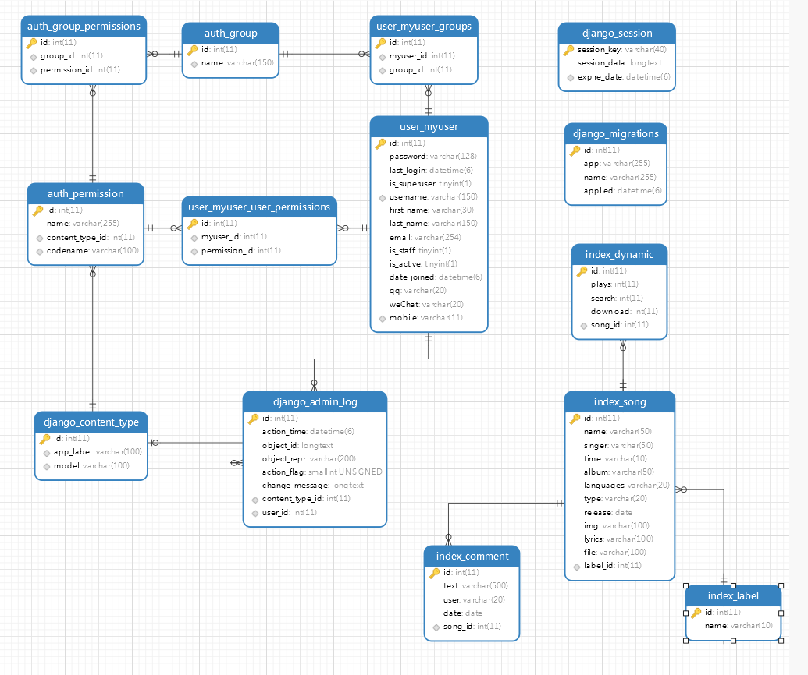

# 张某音乐平台

## 项目设计

​	张某音乐平台的功能分为: 网站首页，歌曲排行榜，歌曲播放，歌曲搜索，歌曲点评和用户管理。

- **网站首页**：是整个网站的主页面，主要显示网站最新的动态信息已经网站功能导航，网站动态信息以歌曲动态为主，比如 热门下载，热门搜索和新歌推荐等；网站功能导航是将其他页面的链接展示在首页上，方便访问浏览。
- **歌曲排行榜**：按照歌曲播放量进行排序，用户还可以根据歌曲类型自定义筛选。
- **歌曲播放**：为用户提供试听功功能，还提供下载，歌曲评论和相关歌曲推荐。
- **歌曲点评**：通过歌曲播放页面进入，每条点评信息包括用户名，点评内容和点评时间。
- **歌曲搜索**：根据用户提供的歌曲关键字或者歌手进行匹配查询，搜索结果用列表展示在页面上。
- **用户管理**：分为用户注册，登录和用户中心，用户中心包含用户信息，用户注销和歌曲播放记录
- **Admin后台管理**：管理后台信息

## 项目目录

```
music
├─ .git
├─ .gitignore
├─ .idea
├─ LICENSE
├─ comment 评论
├─ index   首页
├─ manage.py
├─ media   媒体资源
├─ music   
├─ play	   播放
├─ publicStatic 资源
├─ ranking 排行榜
├─ readme.md
├─ search  搜索
├─ templates
└─ user    用户模块
```

## 数据库关系（MySQL）



## 运行

### 调试模式

```
python manage.py runserver 8000
```

### 上线模式

```
# settings.py
DEBUG = False
ALLOWED_HOSTS = ['*']
STATIC_ROOT = os.path.join(BASE_DIR, 'static')

# 创建静态文件
python manage.py collectstatic

# 配置静态路由 music.urls 加入
    re_path('static/(?P<path>.*)', serve,
            {'document_root': settings.STATIC_ROOT}, name='static')
            
# 运行
python manage.py runserver 8000
```

